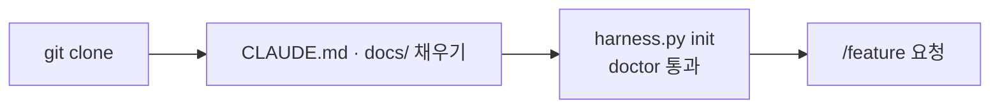
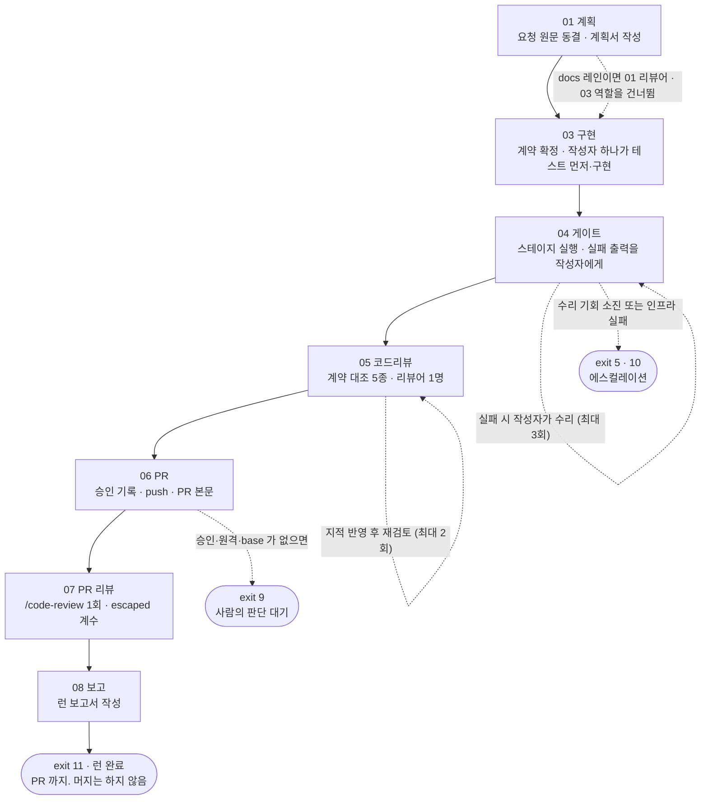

# harness-template

**개발 요청 하나를 계획서 작성부터 PR 생성까지 정해진 순서로 끌고 가는 개발 하네스
템플릿입니다.** 이 저장소를 클론해서 쓰면 `/feature <요청>` 한 번으로 아래 흐름이 돌아갑니다.

계획 → 계약 확정 → 구현 → 게이트(테스트·린트) → 코드 리뷰 → PR 생성 → 보고

레인은 사용자가 선언합니다(`docs` · `fix`), 없으면 `normal` 입니다. 문서만 바뀌는 요청(`docs`)은
계획 리뷰어 · 구현 역할을 건너뛰고, `fix` 는 버그 수리 레인으로 계획 1회차 · 리뷰어 1명으로 짧게
돕니다. `docs` 선언이 빗나가면(소스를 건드리면) 뒤 단계가 그것을 잡아 등급에 남깁니다.

요청을 받자마자 코드를 쓰지 않는 것이 핵심입니다. 단계마다 실행기가 할 일을 지시하고,
산출물을 기계로 검사하고, **통과했을 때만 다음 단계로 넘어갑니다.** 실패하면 정해진
횟수만큼 고쳐 보고, 그래도 안 되면 멈추고 사람에게 넘깁니다.

특징 세 가지입니다.

- 실행기는 **파이썬 표준 라이브러리만** 씁니다. 프로젝트의 패키지 설치가 깨져 있어도
  검사는 그대로 돌아갑니다.
- **어떤 기술 스택에서도 씁니다.** 스택별 지식은 어댑터 파일 한 곳에만 있고, 나머지
  코드는 그것을 모릅니다.
- **PR 생성까지가 범위입니다. 머지는 하지 않습니다.**

## 용어

이 문서와 코드에서 반복해서 나오는 말들입니다.

| 말 | 뜻 |
|---|---|
| **런**(run) | 요청 하나를 PR 까지 끌고 가는 한 번의 작업입니다. 런마다 폴더가 하나 생기고 산출물이 거기 쌓입니다 |
| **페이즈**(phase) | 런을 나눈 단계입니다 — 01 계획부터 08 보고까지 7개. 각 단계의 요구와 산출물은 `harness/phases/01~08.md` 에 있습니다 |
| **계약**(contract) | 이번에 만들 함수와 API 를 미리 적어 둔 문서입니다. 구현 전에 확정하고, 이후 모든 검사의 기준이 됩니다 |
| **유닛 / 진입점** | 계약이 나열하는 함수 하나가 유닛이고, 바깥에서 호출하는 입구(API 경로 등)가 진입점입니다 |
| **어댑터**(adapter) | 스택별 실행 명령을 적어 둔 JSON 파일입니다. 스택을 바꿀 때는 이것만 갈아 끼웁니다 |
| **스테이지**(stage) | 검사 한 종류입니다. 이름 8개(컴파일·린트·의존성·부분 테스트·전체 테스트·E2E·빌드·문서)는 고정이고, 실제 명령은 어댑터가 정합니다 |
| **게이트**(gate) | 통과하지 못하면 다음 단계로 못 가게 막는 검사입니다 |
| **역할**(role)**과 소유 경계** | 03 의 작성자 하나(`impl`)와 그가 수정할 수 있는 파일 범위입니다. 계약 확정·승인·PR 은 메인 세션의 몫이라 그 경계 밖입니다 |
| **봉투**(envelope) | 실행기가 표준 출력으로 내보내는 JSON 객체 하나입니다. "지금 할 일" 과 "다음에 칠 명령" 이 들어 있습니다 |
| **에스컬레이션**(escalation) | 자동으로 풀 수 없을 때 진행을 멈추고 사람에게 넘기는 일입니다 |
| **`PASS_WITH_GAPS`** | "통과했지만 실행하지 못한 검사가 있다" 는 결과 등급입니다 |

## 시작 전 주의사항

1. **`CLAUDE.md` 의 규칙은 자동으로 프롬프트에 주입되지 않습니다.** 파이프라인은
   `harness/config.json` 과 `harness/phases/03-implement.md` 에서 이 파일을 가리킬 뿐이고,
   **규칙은 작업자가 실제로 읽어야 지켜집니다** ([ROADMAP](docs/harness/ROADMAP.md) §4).
2. **순차 실행기 `scripts/execute.py` 는 들어 있지 않습니다.** 권한 승인을 건너뛴 채 모델을
   돌리는 방식이어서 제외했습니다 ([DECISIONS](docs/harness/DECISIONS.md) ADR-H005 · ADR-H037).
3. **아직 검증되지 않은 부분이 있습니다.** 검증 현황은
   [ROADMAP](docs/harness/ROADMAP.md) §6 의 표에 있습니다.

## 빠른 시작



### 1. 클론한 뒤 문서부터 채웁니다

`CLAUDE.md` 의 빈칸과 `docs/` 아래 7개 문서(`PRD` · `TRD` · `API_SPEC` · `ARCHITECTURE` ·
`ADR` · `UI_GUIDE` · `PIPELINE-LOG`)는 빈 골격으로 배포됩니다.
**이 문서들이 하네스 설정의 입력이라서, 순서를 바꾸면 설정에서 채울 수 없는 칸이 생깁니다.**

| 하네스가 알아야 하는 것 | 어느 문서에서 가져오나 |
|---|---|
| 어떤 어댑터를 쓸지 (빌드·테스트 명령이 무엇인지) | `docs/TRD.md` 의 기술 스택 |
| 무엇을 만드는지 (계약에 적을 유닛과 진입점) | `docs/PRD.md` 의 유저 스토리와 기능 요구사항 |
| 역할별 소유 경계 | `docs/ARCHITECTURE.md` 의 디렉토리 구조와 레이어 |
| 검사가 무엇을 봐야 하는지 | `CLAUDE.md` 의 CRITICAL 규칙 |
| 성능·보안의 기준선 | `docs/TRD.md` 의 비기능 요구사항 |

### 2. 설정 파일을 만듭니다

하네스의 설정은 `harness/config.json` 하나입니다. 아래 명령이
`harness/profiles/<어댑터>/config.json` 을 복사하면서 `{{name}}` 자리에 프로젝트 이름을
넣어 저장합니다. 하는 일은 그게 전부이고, 이미 `harness/config.json` 이 있으면 `--force`
없이는 덮어쓰지 않습니다.

```
python scripts/harness.py init --adapter nextjs-ts --name my-project
```

프로필을 미리 두는 이유는 설정 항목 중 **기술 스택이 정해지면 답도 정해지는 것**이 많기
때문입니다. Next.js 프로젝트라면 소스가 `src/` 아래 있고 테스트는 `*.test.ts` 이므로 소유
경계도 자동으로 정해집니다. 아래가 `nextjs-ts` 프로필에 이미 들어 있는 값입니다.

| 항목 | 채워져 있는 값 |
|---|---|
| 역할과 소유 경계 | 작성자 `impl` 하나가 `src/` 의 다섯 하위 트리(`app`·`lib`·`services`·`types`·`components`)와 `src/**` 의 테스트 파일, `e2e/**` 를 소유합니다 (ADR-H075). 그 밖의 `src/` 파일은 `doctor` 가 「소유 경계」 WARN 으로 알립니다 |
| 계약 문서의 절 제목 | `## 유닛` `## 진입점` `## 오류 어휘` 등. 여기 적힌 글자와 `harness/templates/contract.md` 가 정확히 같아야 합니다. 파서가 읽는 절은 유닛·진입점·오류 어휘·데이터 형태 넷이고, `schema`·`boundaries` 절은 사람용입니다 — doctor 는 제목만 대조합니다 |
| 브랜치 규칙 | 기준 브랜치는 `main`, 작업 브랜치는 `feat-` 로 시작, `main` 직접 push 금지 |
| 런당 예산 | 파일 10개 · 1000줄 · 모델 호출 24회 — 셋 다 **보고서용 숫자**이고 넘어도 멈추지 않습니다. 파일 수는 **테스트 파일을 빼고** 셉니다(어댑터 `attribution.test_file_globs` 기준) (ADR-H066 · H075) |
| 코드 리뷰(05) | 리뷰어 하나(`gen`, 일반 정합성). 소스 변경이 있으면 켜지고 `diff+refs` 로 봅니다. 재검토(델타)도 같은 리뷰어입니다 (ADR-H075) |
| 수정 금지 경로 | `harness/**` `docs/**` `scripts/**` `.claude/**` 등 |
| 모델 · effort | `.claude/agents/*.md` 프론트매터가 역할별로 정합니다 — 작성자 `impl-writer` 는 `sonnet · high`, 계획 검토자 `plan-reviewer` 와 05 리뷰어 `general-reviewer` 는 `opus · high` (ADR-H061 · H075 · H076). 봉투는 모델을 지시하지 않습니다. **미검증 초기값**입니다 |

**지금 프로필은 `nextjs-ts` 하나뿐입니다.** 프로필은 템플릿 `harness/config.json` 과 키가 같아야 하고, `reviewers` · `review` 블록은 값까지 같아야 합니다 — 빠지면 클론에서 그 기능이 조용히 꺼지기 때문에 테스트(`ProfileParityTest`)가 막습니다. 다른 스택이라면 이 명령 대신
`harness/profiles/nextjs-ts/config.json` 을 `harness/config.json` 으로 복사한 뒤 위 표의
항목을 고치면 됩니다. 어디가 틀렸는지는 다음 단계의 `doctor` 가 알려 줍니다.

### 3. `doctor` 를 통과시킵니다

설정과 실제 저장소가 어긋난 곳을 실행 전에 찾습니다.

```
python scripts/pipeline/cli.py doctor
```

파이썬 버전, 설정 파일 형식, 어댑터가 요구하는 파일의 존재, 실행할 명령의 존재, 역할별
소유 경계의 중복, 계약 문서의 절 제목과 설정의 일치, 원격과 기준 브랜치의 존재를 봅니다.

**exit 2 가 나오면 거기서 멈추고 FAIL 항목부터 고칩니다.** 경고는 통과시키되 전부
출력합니다. 건너뛴 검사는 통과가 아니어서 마지막 보고서까지 따라갑니다.

### 4. `/feature <요청>` 을 칩니다

여기서부터는 파이프라인이 끌고 갑니다.

## E2E 설정

**동봉된 어댑터는 둘 다 E2E 가 꺼져 있습니다** (`stages.e2e.cmd: null`). 명령이 `null` 인
스테이지는 통과가 아니라 **없는 것**이어서, 04 게이트가 `stage_absent:e2e` 로 기록하고 등급을
`PASS_WITH_GAPS` 로 내립니다. 스택에 E2E 가 **구조적으로 없다면** 같은 자리에
`not_applicable` 사유를 적습니다 — 그러면 `stage_na:e2e` 로 기록되고 등급은 내려가지 않습니다
(ADR-H047 추기).

켜는 순서입니다. 근거는 `harness/adapters/nextjs-ts.json` 의 `stages.e2e._note` 입니다.

1. **프로젝트 `docs/ADR.md` 에 도입을 먼저 결정합니다.** 새 의존성(예: Playwright)이라 ADR 없이 넣지 않습니다
2. **어댑터 `stages.e2e` 에 `cmd` 를 채웁니다.** 관련 파일이 바뀐 런에서만 돌게 하려면
   `when_touched` 를 함께 적습니다 — 예: `["e2e/**", "src/app/**"]`. 안 걸리면 `not_touched` 로 건너뜁니다
3. **테스트 DB 처럼 외부 자원이 필요하면 `infra_preflight` 에 프로브를 둡니다**
   (`kind`: `tcp` · `cmd` · `env`, `required_when_touched` 로 조건부). `on_missing` 을 안 적으면
   `fail` 이라 exit 10 으로 멈추고, `warn` 이면 `infra_skipped:<프로브 이름>` gap 으로 등급만
   내립니다 — `warn` 은 `why` 에 사유를 적어야 합니다
4. **스펙 위치를 어댑터 `attribution` 에 알립니다.** `test_file_globs` 에 스펙(`e2e/**/*.spec.ts`),
   `e2e_file_globs` 에 E2E 폴더(`e2e/**`)를 둡니다. 뒤의 것은 `contract-trace` 의 진입점·오류 어휘
   테스트 검사에서 빠집니다 — E2E 스펙이 유닛 테스트의 부재를 가리지 않게 하려는 것입니다
5. **`test_report.glob` 에는 E2E 리포트를 넣지 않습니다.** 테스트 수 신호는 전체 테스트(`full`)
   전용이고, 지난 런의 리포트가 이번에 안 돈 런의 실적이 됩니다
6. **`python scripts/harness.py doctor` 를 다시 돌립니다**

켜고 나면 이렇게 돕니다.

- **게이트 순서** — 수리 루프(`compile → lint → check → scoped`)가 끝난 뒤 `full → e2e · build · docs`
- **소유** — `e2e/**` 는 작성자 `impl` 의 경로입니다 (`harness/config.json` 의 `roles`)

## 7단계가 어떻게 돌아가나

한 페이즈는 호출 두 번으로 끝납니다. `next` 를 치면 실행기가 할 일을 지시하고, 모델이
산출물을 지정된 경로에 쓰고, `record` 를 치면 실행기가 그것을 검사한 뒤 통과 시 다음
페이즈로 넘깁니다. (04 는 `record` 대신 `gate`, 08 은 `report` 로 닫습니다.)

실행기의 출력은 **언제나 JSON 객체 하나**이고, 모델이 읽는 것은 "지금 할 일" 과
"다음에 칠 명령" 뿐입니다.



| 단계 | 무엇을 하나 | 무엇이 나오나 | 언제 통과하고 언제 멈추나 |
|---|---|---|---|
| **01 계획** | 사용자의 원본 요청을 동결하고, 그 요청을 빠짐없이 덮는 계획서를 씁니다. 계획 검토자(`plan-reviewer`)가 요청 원문·계획서·계획서가 가리키는 코드를 읽고 지적을 냅니다 | 계획서와 회차별 리뷰 기록 | 열린 Critical 이 0건이면 넘어갑니다. 코드로 반박되는 Critical 은 메인이 근거(실재하는 경로)를 적어 기각할 수 있고 그 기록이 보고서에 남습니다. 반복해도 수렴하지 않으면 에스컬레이션합니다 |
| **03 구현** | 이번에 만들 유닛과 진입점 목록(계약)을 먼저 확정하고, 작성자 하나가 계약의 항목마다 **테스트를 먼저 쓰고** 구현한 뒤 typecheck·lint·테스트를 직접 돌립니다. 만들 것을 미리 못 박기 때문에 테스트가 구현에 맞춰지는 일이 없습니다 | 계약 문서와 작성자의 작업 목록 | 계약의 진입점·오류 어휘마다 테스트가 있어야 하고, 컴파일·타입 검사를 통과해야 합니다 |
| **04 게이트** | 어댑터에 적힌 스테이지를 순서대로 실행하고, 실패한 스테이지의 출력을 작성자에게 그대로 되돌립니다 — 작성자의 「통과했다」를 믿지 않는 영수증입니다 | 스테이지 결과 | 수리 기회는 3회입니다. 인프라 패턴에 걸린 실패는 기회를 쓰지 않고 바로 사람에게 넘깁니다. 테스트 0개는 기록만 하고 막지 않지만, 직전 완주 런보다 테스트 수가 크게 줄면 막습니다 |
| **05 코드리뷰** | 04 가 "동작하는가" 를 봤다면 05 는 "계약대로 만들었는가" 를 봅니다. 비용이 들지 않는 `precheck` 와 계약 대조 5종부터 돌리고, 리뷰어 하나(`gen`)가 diff 와 참조 파일을 읽습니다. 수리 작성자는 04 와 같은 작성자입니다 (ADR-H064) | 계약 대조 결과, 리뷰 결과 | 재검토는 2회까지이고 같은 리뷰어가 봅니다. 리뷰어가 실패했거나 소스 변경이 없어 0명이면 등급이 `PASS_WITH_GAPS` 로 내려갑니다. 리뷰어가 계약 결함(`CONTRACT_DEFECT`)을 내거나 05 에서 계약이 바뀌면 멈추고 사람에게 넘깁니다 |
| **06 PR** | 승인을 받아 기록으로 남기고, 계약 문서를 삭제한 뒤 원격에 push 하고, PR 본문을 만듭니다. 실제 PR 생성은 메인 세션이 GitHub 도구로 합니다 | PR 본문과 PR 생성 요청서 | 승인이 없거나 원격·base 브랜치가 없으면 exit 9 로 정상 종료하고 사람을 기다립니다. 승인 후 코드가 바뀌면 다시 승인받습니다. 원격과 어긋나면 강제로 덮어쓰지 않고 멈춥니다 |
| **07 PR 리뷰** | 05 가 우리 코드를 우리가 본 것이라면 07 은 **다른 눈이 한 번 더** 보는 단계입니다. `/code-review` 를 1회 부르고, 05 가 이미 낸 것과 같은 결함은 키로 가리켜 접습니다. 남는 Critical/Major 가 05 가 놓친 것(escaped)이고, 그 수가 05 리뷰 정책의 근거가 됩니다 | PR 리뷰 결과 (`07_pr_review.json`) | 새 Critical/Major 가 있으면 등급이 `PASS_WITH_GAPS` 로 내려가고 수리는 사람이 정합니다. 멈추지 않습니다 |
| **08 보고** | 이번 런의 보고서를 씁니다. 숫자 표는 실행기가 기록에서 조립하고, 원인과 해결은 모델이 씁니다. 코드도 diff 도 보지 않습니다. | `docs/harness/pipeline/runs/` 아래 보고서 | 보고서가 부실해도 파이프라인을 실패시키지 않습니다. 다만 **실행하지 못한 검사가 통과처럼 보이는 것**은 막습니다 |

## 어떤 파일이 무엇을 하나

### `harness/` — 설정과 선언

| 경로 | 무엇 |
|---|---|
| `config.json` | 이 프로젝트의 설정 하나입니다. 어댑터, 역할과 소유 경계, 계약 문서의 절 제목, 리뷰어, 런당 예산(보고서용 — 테스트를 뺀 파일 수·줄 수·모델 호출 수), 브랜치 규칙이 들어갑니다 |
| `config.schema.json` | 위 파일의 스키마입니다. 검사기는 표준 라이브러리로 직접 만들었고, `_` 로 시작하는 키는 주석으로 보고 건너뜁니다. `reviewers` · `review` 는 필수입니다 |
| `adapters/*.json` | 스택별 명령 모음입니다. `self-python`(이 저장소 자신) · `nextjs-ts` · `_template`(새로 만들 때 복사하는 빈 틀) |
| `adapters/adapter.schema.json` | 어댑터의 스키마입니다. **실행 허용 명령 목록이 여기 있습니다** — 실행기 코드에 두지 않습니다 |
| `profiles/<어댑터>/config.json` | 미리 채워 둔 설정 프로필입니다. `harness.py init` 이 복사하면서 프로젝트 이름만 바꿔 넣습니다. 템플릿 `config.json` 과 키가 같아야 합니다 |
| `phases/01~08.md` | 각 페이즈의 정의입니다. 문서 맨 위 JSON 에 요구(`requires`)·산출(`produces`)·재시도 상한(`loop`)이 적혀 있습니다 |
| `templates/contract.md` | 계약 문서의 빈 틀입니다. 절 제목은 `config.json` 과 글자까지 같아야 하고, 다르면 `doctor` 가 미리 막습니다 |

**어댑터는 스택 지식을 한 곳에 격리합니다.** 스테이지 이름 8개
(`compile` · `lint` · `check` · `scoped` · `full` · `e2e` · `build` · `docs`)는 코어가
고정하고, 각 이름에 붙는 **실제 명령은 어댑터가 정합니다.** 페이즈 정의는 이름만 부르기
때문에 스택을 바꿔도 코어 코드는 한 줄도 바뀌지 않습니다. 명령이 `null` 인 스테이지는
**없는 것**이지 통과한 것이 아니고, 결과에도 그렇게 남습니다.

### `scripts/` — 실행기

| 경로 | 무엇 |
|---|---|
| `harness.py` | 설정을 다루는 명령들입니다 — `init` · `doctor` |
| `pipeline/cli.py` | 7단계 파이프라인의 입구입니다. 명령을 해석하고, 페이즈 정의를 읽고, 진입 조건을 따지고, 결과를 JSON 으로 내보냅니다 |
| `pipeline/state.py` | 런 폴더와 진행 상태, 이벤트 기록, 작업 트리 해시를 다룹니다. 상태 이름과 등급 이름이 이 파일 하나에서 나옵니다 |
| `pipeline/adapters.py` | 어댑터를 읽고 스테이지를 실행합니다. 판정하거나 상태를 쓰지는 않습니다 |
| `pipeline/contract.py` | 계약 문서를 파싱하고 실행할 테스트를 골라냅니다. 절 제목이 이 파일에 하드코딩되어 있지 않습니다 |
| `pipeline/gate.py` | 04 의 본체입니다. 스테이지를 순서대로 실행하고 등급을 매깁니다. 전체 테스트는 수리 루프가 끝난 뒤 한 번만 돌립니다 |
| `pipeline/trace_contract.py` | 계약에 적은 것이 코드에 실제로 있는지 5가지로 대조합니다(구현·진입점·오류 상수 누락, 테스트 없는 진입점·오류 상수). 오탐 이력이 있던 검사들은 지웠습니다 (ADR-H075) |
| `pipeline/review.py` | 리뷰어 하나의 제출을 검사하고 라운드를 가로질러 지적을 접습니다. **자기가 쓴 코드를 자기가 리뷰할 수 없다**는 규칙을 여기서 강제합니다. |
| `pipeline/precheck.py` | 05 에서 가장 먼저 도는 무비용 검사입니다. 브랜치, 기준 브랜치와의 차이, 환경을 봅니다. 예산(파일 수는 테스트 제외)은 정보로만 적습니다. 모델도 테스트도 부르지 않습니다 |
| `pipeline/mask.py` | 외부로 나가는 텍스트(PR 본문·코멘트)의 비밀값을 마스킹합니다. 내부 기록에는 원문을 남깁니다 |
| `pipeline/pr.py` | 06 의 본체입니다. 승인과 push, PR 요청서까지 만듭니다. **GitHub 을 직접 호출하지 않습니다** — 실행기는 git 명령까지만 실행합니다 |
| `pipeline/report.py` | 08 입니다. 표는 실행기가 조립하고 설명은 모델이 씁니다 |
| `pipeline/verdict.py` | 리뷰어 제출이 조건을 맞췄는지 판정합니다. 인용이 원문에 있는지, 심각도 헤딩 수가 맞는지, 열린 Critical 이 0건이라 수렴했는지를 봅니다 |
| `runtime.py` | 시각, 대화 기록 읽기, 출력 인코딩처럼 여러 곳이 함께 쓰는 도구입니다 |
| `test_harness.py` · `test_pipeline.py` · `test_runtime.py` | 하네스 자신의 테스트입니다 |

### `.claude/` — 명령과 에이전트

| 경로 | 무엇 |
|---|---|
| `commands/feature.md` | `/feature` 명령입니다. `doctor` 로 열고, 사용자의 요청을 한 글자도 바꾸지 않고 동결한 다음, 종료 코드에 따라 다음 행동을 정합니다. 레인은 사용자가 말했을 때만 `--profile` 로 주고, 모델은 에이전트 프론트매터에 맡깁니다 |
| `agents/impl-writer.md` | 03 이 부르는 작성자 하나입니다. 계약의 항목마다 테스트를 먼저 쓰고 구현하며, typecheck·lint·테스트를 직접 돌립니다. 화면 컴포넌트를 만들면 `docs/UI_GUIDE.md` 를 따릅니다 |
| `agents/plan-reviewer.md` | 01 이 부르는 검토자입니다. 계획을 직접 고치지 않고 지적만 냅니다. `docs` 레인에서는 부르지 않습니다 |
| `agents/general-reviewer.md` | 05 의 리뷰어입니다(일반 정합성). 봉투가 이름 짓고 Agent 호출로 부릅니다. 소스 변경이 있으면 켜지고, 계약이 재사용하라는 심볼의 정의까지 열어 봅니다. 소스 변경이 없는 `docs` 런에서는 문서와 요청의 정합을 봅니다 |
| `settings.json` | 훅 1개입니다 — 위험한 셸 명령 차단 |

### `docs/`

| 경로 | 무엇 |
|---|---|
| `docs/` 바로 아래 7개 | **프로젝트가 채우는 자리**입니다. 빈 골격으로 배포됩니다 |
| `docs/harness/ROADMAP.md` | 이 템플릿의 구성물, 시작 순서, **검증된 것과 아직인 것** |
| `docs/harness/DECISIONS.md` | 왜 그렇게 만들었는지에 대한 결정 기록입니다 (`ADR-H001`~`ADR-H076`) |
| `docs/harness/PILOT-LOG.md` | 런마다 실제로 잰 값입니다. **추정치는 적지 않고, 재보지 않은 것은 "미측정" 으로 남깁니다** |

## 명령어

### `python scripts/harness.py` — 설정을 다룹니다

| 명령 | 하는 일 |
|---|---|
| `init --adapter <이름> --name <프로젝트>` | `harness/profiles/<이름>/config.json` 을 복사해 `harness/config.json` 을 만듭니다. 이미 있으면 `--force` 없이는 덮어쓰지 않습니다 |
| `doctor` | 설정과 저장소가 어긋난 곳을 찾아 사람이 읽는 보고서로 냅니다 |

### `python scripts/pipeline/cli.py` — 파이프라인을 돌립니다

`--help` 가 없습니다. 도움말이 화면으로 나가면 "출력은 JSON 객체 하나" 라는 약속이 깨집니다.

| 명령 | 하는 일 |
|---|---|
| `doctor` | 설정 검사에 더해 파이프라인 쪽 6가지를 봅니다(런 폴더가 git 에서 제외됐는지, 에이전트 정의가 있는지, 페이즈 정의가 온전한지, 계약 틀이 파싱되는지, 리뷰어 설정이 맞는지, 원격과 기준 브랜치가 있는지) |
| `init --feature <이름> --request-file <경로> [--profile docs\|fix\|normal]` | 런을 만들고, 요청 파일을 한 글자도 바꾸지 않은 채로 동결합니다. `--profile` 은 사용자가 이미 레인을 말했을 때만 줍니다(기본 `normal`) |
| `next [--run-id <아이디>]` | 진입 조건을 확인하고 다음 할 일을 알려 줍니다. 세션이 끊겼을 때 이어서 하는 방법도 이 명령입니다 |
| `record --phase <번호> [--file …] [--reviewer …] [--round n] [--failed]` | 산출물을 검사하고, 통과하면 다음 페이즈로 넘깁니다 |
| `gate [--phase 04] [--stage <이름>]` | 스테이지를 실행하고 결과를 기록합니다. 실패하면 그 출력을 작성자에게 되돌립니다 |
| `resume --ack` | 멈춰 둔 상태를 푸는 **전용** 명령입니다 |
| `status` | 지금 상태를 보여 줍니다. **언제나 exit 0 입니다** |
| `lint-phases [--dir <경로>]` | 페이즈 정의 파일의 정합을 봅니다. **CI 없이도 돌아가는 유일한 검증 장치입니다** |
| `precheck [--scope pr] [--phase 05]` | 브랜치, 기준 브랜치와의 차이, 환경을 미리 봅니다. 예산(파일 수는 테스트 제외)은 정보 행으로만 적습니다 — exit 9 는 브랜치·base 둘뿐입니다 (ADR-H075) |
| `contract-trace [--contract <경로>]` | 계약에 적은 것이 코드에 실제로 있는지 대조합니다 |
| `approve --phase 06 [--auto] [--revoke]` | 승인을 기록으로 남깁니다. 그 시점의 작업 트리 해시와 등급을 함께 적습니다 |
| `pr` | 06 의 여섯 과정을 싼 것부터 돌리고 처음 실패한 곳에서 멈춥니다 |
| `report [--out <경로>]` | 08 보고서를 조립합니다 |

### 종료 코드

명령이 끝날 때 남기는 숫자입니다. `/feature` 는 이 숫자로 다음 행동을 정합니다.

| 코드 | 뜻 | 코드 | 뜻 |
|---|---|---|---|
| `0` | 성공 | `6` | 게이트 이후 코드가 바뀌어 넘길 수 없음 |
| `1` | 내부 오류 | `7` | 쓰지 않습니다 — 반복 한계도 `10` 입니다 (ADR-H076) |
| `2` | 사용법이 틀렸거나 `doctor` 실패 | `8` | 제출한 산출물이 조건 위반 |
| `3` | 앞 페이즈 조건이 아직 안 갖춰짐 | `9` | 사람의 판단 대기 |
| `4` | 게이트 실패 (수리 기회 남음) | `10` | 에스컬레이션 (상태를 잠급니다) |
| `5` | 수리 기회 소진 | `11` | 런 완료 |

### 하네스 자신의 테스트 돌리기

```
python -m pytest scripts/
```

## 더 읽을 곳

- [docs/harness/ROADMAP.md](docs/harness/ROADMAP.md) — 템플릿의 구성물(§1), 시작 순서(§4),
  **검증된 것과 아직인 것**(§6)
- [docs/harness/DECISIONS.md](docs/harness/DECISIONS.md) — 왜 그렇게 만들었는지 (`ADR-H001`~`ADR-H076`)
- [CLAUDE.md](CLAUDE.md) — 작업 원칙과 프로젝트 규칙. **작업자가 직접 읽어야 지켜집니다**
