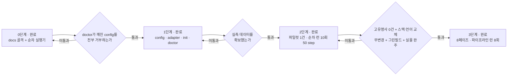
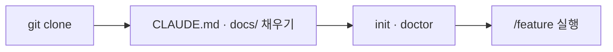

# 하네스 승격 로드맵

> **이 문서의 위치**
> 이 문서는 **템플릿 리포 자신**에 대한 것이다. 클론한 프로젝트가 채우는
> `/docs/PRD.md`·`/docs/TRD.md` 등과는 층이 다르다. `docs/harness/` 하위는 하네스
> 자체의 문서이고, `docs/` 직속 7종은 **프로젝트가 채우는 자리**다.
> 프로젝트 작업 중에는 이 폴더를 읽기만 하고 고치지 않는다. 고치는 것은 하네스
> 작업일 때뿐이다.

> **파일럿의 런 기록은 이 판에서 걷어냈다.** 한 파일럿 프로젝트에서 잰 숫자는 그
> 프로젝트의 사실이지 이 템플릿의 사실이 아니고, 남의 실측을 상속하는 것은 이
> 리포가 [ADR-H001](DECISIONS.md)에서 금지한 것과 같은 위반이다. **원본은 추출
> 이력(`git log`)에 그대로 있고**, 그 실측이 무엇을 정했는지는
> [DECISIONS.md](DECISIONS.md) 의 ADR-H001~H040 가 든다.

---

## 1. 이 템플릿에 무엇이 들어 있나

| 계층 | 내용 |
|------|------|
| 문서 골격 | `docs/` 7종 — PRD · TRD · API_SPEC · ARCHITECTURE · ADR · UI_GUIDE · PIPELINE-LOG. **전부 빈 골격이고 프로젝트가 채운다** |
| 가드레일 | `CLAUDE.md` — `## 작업 원칙` 넷만 채워져 있고 나머지는 플레이스홀더다. **8페이즈 코어는 이 파일을 자동 주입하지 않는다** (§4) |
| **계약 계층** | `harness/config.json` · `config.schema.json` · `adapters/{self-python,nextjs-ts,_template}.json` + `adapter.schema.json` · `profiles/nextjs-ts/` · `templates/contract.md` |
| 실행기 | `scripts/harness.py` — `init` · `doctor` · `calibrate`. `scripts/runtime.py` — 시각·트랜스크립트 읽기·출력 인코딩의 공유 원시요소 ([ADR-H037](DECISIONS.md)) |
| **파이프라인 코어** | `scripts/pipeline/{cli,state,adapters,attribution,verdict,contract,gate,trace_contract,review,precheck,ledger,mask,pr,promote,review07,report,triage}.py` — 8페이즈 실행기. `doctor` · `init --feature` · `next` · `record` · `gate` · `advance` · `retry` · `escalate` · `resume` · `status` · `lint-phases` · `precheck` · `contract-trace` · `approve` · `mask` · `pr` · `promote` · `review07` · `report`. **stdout 은 언제나 단일 JSON 봉투 하나**. 모듈명이 `trace.py` 가 아닌 것은 stdlib `trace` 를 가리기 때문이다 |
| **페이즈 파일** | `harness/phases/{00-triage,01-plan,02-cross-verify,03-implement,04-gate,05-code-review,06-pr,07-pr-review,08-report}.md` — `---` 로 감싼 JSON 프론트매터. 00 은 요청을 레인(`docs`·`small`·`normal`)으로 나누는 예측이고 03·05 가 검증한다 (ADR-H044). 여덟이 다 섰고 `lint-phases` 의 FUTURE 전이는 0건이다 |
| **리뷰어 · 원장** | `.claude/skills/{general,data-layer,security,architecture,test-quality,docs}-reviewer/SKILL.md` — 스택 비종속 관점 6종. `general` 은 소스 변경이 있으면 항상 켜지고 07 이 깨끗한 런을 생략하는 근거다 (ADR-H043). 각 파일의 `## 프로젝트 보강` 절은 **비운 채로** 배포한다(그 절이 비어 갈수록 하네스가 성숙한 것이다). `docs/harness/pipeline/ledger/{taxonomy.json,findings.jsonl,rules_changelog.md}` — `taxonomy.json` 하나가 **원장 어휘 · 승격 목적지 · 리뷰 범위** 셋의 단일 출처다. **`findings.jsonl` 은 비어 있다** (§6) |
| **진입점** | `.claude/commands/feature.md` (`/feature` — 01~08 전부. push 는 실행기가 하고 **PR 생성·코멘트 게시는 메인 세션이 forge 도구로** 한다. **머지는 범위 밖**) · `.claude/commands/log.md` (`/log`) · `.claude/agents/{impl-writer,test-writer,plan-reviewer}.md` (각 3KB 이하 — 소유 경계·제출 형식·금지만 담고 규약은 담지 않는다) |
| 테스트 | `scripts/test_harness.py` · `scripts/test_pipeline.py` · `scripts/test_runtime.py` — `python -m pytest scripts/` |
| **파이프라인 명세** | `docs/harness/pipeline/team-spec.md` — **8페이즈의 정본.** 페이즈 01~08 · 종료 코드표 · 실패 3분류·매트릭스 · 수렴 판정 · 귀속 규칙 · 승격 임계값 · §E1~E14 · §P1~P6 |
| 실측 | `harness/calibration.json` — `calibrate` 산출. 정책 5종이 여기서 유도된다. **지금은 전부 미측정이고 첫 `calibrate` 가 채운다** |

`python scripts/pipeline/cli.py doctor` 가 하는 일: python 런타임 · config·어댑터
스키마 · 어댑터 전제조건 · 러너 바이너리 · 스테이지 명령의 실물 존재 · 역할과 소유
경계 · 계약 절 ↔ 템플릿 일치 · base 브랜치와 원격 · 경로 240자 상한 · 캘리브레이션
상태. 실패는 exit 2 로 `/feature` 진입 자체를 막고, **경고는 통과시키되 전부 출력에
드러낸다** — 스킵됨은 통과가 아니다.

**순차 실행기(`scripts/execute.py`)는 이 템플릿에 없다.** `claude -p
--dangerously-skip-permissions` 를 헤드리스로 띄우는 승인 우회를 클론하는 사람이
물려받게 하지 않기 위해서다 ([ADR-H005](DECISIONS.md) · [ADR-H037](DECISIONS.md)).
그 결과가 §4 의 `CLAUDE.md` 주입 주의사항이다.

---

## 2. 결정 — 단계적 승격

목표 파이프라인(스택 비종속 8페이즈 feature-pipeline: `doctor`/`calibrate`/
`contract-trace`/리뷰어 라우팅/규칙 원장)은 **한 번에 이식하지 않는다.** 검증을
통과한 계층만 템플릿으로 승격한다.

### 왜 지금 전부 넣지 않는가

1. **실측 없는 상수를 상속하지 않는다.** 정책(백그라운드 회귀 여부, 타임아웃, 테스트 수 하한)은 전부 실측값의 함수다. 그 값이 생기기 전에 정책을 상수로 굳히면 근거 없는 숫자를 모든 파생 프로젝트가 물려받는다.
2. **검증 전 승격 금지.** 어댑터의 `verified` 플래그와 같은 원칙이다 — 실제 프로젝트에서 완주시킨 뒤에만 `true` 로 올린다. 문서·스크립트에도 같은 규율을 적용한다.
3. **그렇다고 프로젝트마다 하네스를 새로 만들지도 않는다.** 그러면 일반화의 목적이 무너진다. 개선이 축적되지 않고, 고유명사·상수가 매번 다시 박힌다.

### 흔한 오해

"하네스를 템플릿에 넣는 것" 과 "프로젝트마다 docs 를 먼저 채우는 것" 은 **배타적이지
않다.** 파이프라인도 `클론 → init → doctor → 실행` 을 전제한다. 두 가지는 동시에
성립하며, 진짜 갈림길은 **"검증 안 된 것을 지금 굳힐 것인가"** 뿐이다.

---

## 3. 3단계 로드맵

| 단계 | 내용 | 승격 조건 | 상태 |
|------|------|-----------|------|
| **0. 골격** | docs 골격 + 단순 순차 실행기 | — | 완료 |
| **1. 계약 계층** | `harness/config.json` · `config.schema.json` · 어댑터 스키마 · `init` · `doctor` | 일부러 깨뜨린 config(역할 소유 겹침 · 계약 절 불일치 · 화이트리스트 밖 러너 등)를 `doctor` 가 **전부 거부**하고, 정상 config 는 통과 | **완료** — `scripts/test_harness.py` 의 거부 8종 + 오탐 검사가 게이트다 |
| **2. 파일럿** | 첫 실제 프로젝트를 **순차 실행기로** 완주. 부족한 지점을 기록 | 스테이지별 실측 시간 · 테스트 개수 · 린트 위반 기준선 확보 | **완료** — 열 런 50 step. 실측 원문은 추출 이력에 있다 |
| **3. 8페이즈 승격** | 파일럿 실측을 근거로 파이프라인을 이식 | **다섯 줄 ([ADR-H013](DECISIONS.md))** — ① 코어에 고유명사 grep **0건** ② 어댑터만 바꿔 스택 교체 시 코어 무변경 ③ 언어 교체 시 코어 무변경 ④ 그린필드 테스트 0개가 `PASS_WITH_GAPS` ⑤ 파일럿 기능 1건을 01~04 로 **실물 완주** | **다섯 줄 전부 통과** — 그 뒤 파이프라인 런 8회가 8페이즈를 실물에서 완주시켰다 |

각 단계의 게이트를 통과하지 못하면 **다음 단계로 넘어가지 않는다.** "일단 넣고
나중에 고친다" 는 이 로드맵이 막으려는 실패 자체다.

---

## 4. 프로젝트 시작 순서

**어느 단계에 있든 이 순서는 바뀌지 않는다.**

### 왜 docs 가 먼저인가

문서가 하네스 설정의 **입력**이기 때문이다. 순서를 뒤집으면 채울 수 없는 칸이 생긴다.

| 하네스가 알아야 하는 것 | 출처 |
|------------------------|------|
| 어떤 어댑터를 쓸 것인가 (빌드·테스트 명령) | `/docs/TRD.md` 기술 스택 |
| 무엇을 만드는가 (계약의 유닛·진입점) | `/docs/PRD.md` 유저 스토리 · 기능 요구사항 |
| 역할별 소유 경계 glob | `/docs/ARCHITECTURE.md` 디렉토리 구조 · 레이어 의존 관계 |
| 게이트가 검사할 규칙 | `CLAUDE.md` CRITICAL 규칙 |
| 성능·보안 기준선 | `/docs/TRD.md` 비기능 요구사항 |

TRD 의 기술 스택이 비어 있으면 어댑터를 고를 수 없고, PRD 의 유저 스토리가 없으면
계약을 쓸 수 없다.

### ⚠ `CLAUDE.md` 는 자동으로 주입되지 않는다

이 템플릿에는 **`CLAUDE.md` 를 프롬프트에 넣는 코드가 없다.** 그 일을 하던 것은
순차 실행기의 `_load_guardrails` 하나뿐이었고([ADR-H008](DECISIONS.md)), 그 실행기는
추출 범위 밖이다(§1). 8페이즈 코어는 `harness/config.json` 의 `instruction_file`
선언과 `03-implement` 의 「읽을 곳」으로 **가리키기만** 한다.

**그래서 규칙은 워커가 읽어야 지켜진다.** 이것을 모르면 *"가드레일이 자동
주입된다"* 고 오해하게 되고, **워커가 규칙을 못 본 채 지켰다고 보고하는 것**이 이
리포가 최악으로 치는 실패다.

---

## 5. 지금 하지 않는 것

| 항목 | 이유 |
|------|------|
| 기존 리포에 하네스를 주입하는 부트스트랩 | 클론 방식을 택했다. 필요해지면 `init --into <path>` 로 나중에 |
| git submodule 배치 | 경로 상대화 비용이 이득보다 크다 |
| 어댑터 3종 이상 (pytest · go · cargo) | **실제로 돌려본 것만 동봉한다.** 템플릿과 문서만 둔다 |
| GitLab · Bitbucket 지원 | 두 번째 forge 가 실제로 필요해질 때. 지금 만들면 검증 불가 |
| 하네스를 프로젝트 스택 언어로 재작성 | 스택마다 실행기를 다시 만들게 되어 일반화의 목적이 무너진다 |
| 머지 자동화 | 파이프라인의 범위는 PR 까지 |

---

## 6. 검증된 것과 아직 아닌 것

**이 절이 이 문서에서 가장 중요하다.** 둘을 같은 칸에 넣지 않는 것이 이 리포의 규율이다.

| 항목 | 상태 |
|---|---|
| 8페이즈 01~08 실물 완주 | **검증됨** — 한 파일럿에서 파이프라인 런 8회 |
| `doctor` 의 거부 8종 | **검증됨** — 일부러 깨뜨린 config 를 전부 거부한다 |
| 스택 교체 시 코어 무변경 | **검증됨** — 어댑터를 갈아도 코어는 0줄이다 ([ADR-H038](DECISIONS.md)) |
| **어댑터 `verified`** | **`false` 다.** 동봉 어댑터가 셋 다 `false` 이고, 그것이 정직한 값이다 |
| **`calibration.json`** | **전부 미측정.** 첫 `calibrate` 가 채운다 |
| **`findings.jsonl` · 승격 임계** | **표본 0.** `THRESHOLDS` 여섯 숫자는 아직 캘리브레이션되지 않았다 |

**어댑터 `verified: true` 를 기다리지 않기로 했다.** 승격 조건은 *"`attribution` 의
실패 경로가 실물 러너 출력에서 돈다"* 인데, 파일럿에서 일곱 런 연속 자연 실패가 오지
않았다. **일부러 실패를 만들어 통과시키는 것은 검증이 아니라 결과를 만들어 내는
것**이라 하지 않았다. 클론한 프로젝트에서 자연 실패가 오면 그때 올린다.

---

## 7. 이어서 볼 열린 질문

파일럿이 답을 못 낸 채 넘긴 것들이다. **값을 지금 정하지 않는다** — 재지 않은 것을
근거로 상수를 정하지 않는 것이 [ADR-H007](DECISIONS.md) 의 규율이다.

1. **접두부 예산의 단위.** 접두부 총량과 비용의 상관은 파일럿에서 흔들렸고, 더 강한
   축은 **세션이 끌어온 양**과 **접두부 × turn** 이었다. 상한을 어디에 걸지는 미정이다
2. **`instruction_slot_budget` 을 아무도 안 센다.** 선언은 있고 소비자가 없다.
   **첫 승격이 실물에서 돈 뒤에** 단위를 정한다
3. **승격 임계 여섯 숫자.** 승격 축이 `rule_key` 로 바뀐 뒤([ADR-H034](DECISIONS.md))
   3런에 판정하기로 했는데, 그 3런은 클론한 프로젝트에서 돈다
4. **리뷰어 호출 고정비.** 실행기의 계수가 형식 교정 왕복과 07 내장 리뷰를 안 세서
   실측과 갈렸다. 원장이 쌓이면 답이 나온다. **01 의 2라운드 이후·전이가 바로 내는
   다음 페이즈 지시·05 `merged`·승격 판정이 계수 밖이던 것은 닫혔다**
   ([ADR-H042](DECISIONS.md)) — 남은 것은 형식 교정 왕복이다
5. **트리아지 임계값 셋과 모델 등급 표.** `config.triage` 의 `small_max_paths` ·
   `normal_min_chars` · `model_call_when_undecided` 와 `config.models` 의 슬롯별
   등급은 실측 없이 고른 초기값이다 ([ADR-H044](DECISIONS.md)). 첫 세 런의
   `00_triage.json` 과 `triage_miss` 이벤트가 검사한다 — miss 가 docs 예측에서만
   나면 docs 규칙이 헐거운 것이고, 모델 호출이 매 런 나면 규칙이 너무 좁은 것이다

---

## 8. 이 템플릿 자신을 고칠 때

`docs/harness/` 를 고치는 것은 **하네스 작업일 때뿐**이다. 프로젝트 작업 중에는
읽기만 한다.

- 결정은 [DECISIONS.md](DECISIONS.md) 에 `ADR-H` 번호로 남긴다. **검증한 것만
  승격하고, 실측 없는 상수를 상속하지 않는다**
- 런별 실측은 [PILOT-LOG.md](PILOT-LOG.md) 에 남긴다. **추정치를 적지 않는다 —
  재보지 않은 것은 「미측정」으로 남긴다**
- 8페이즈의 정본은 [pipeline/team-spec.md](pipeline/team-spec.md) 다. 계약을 바꾸면
  거기를 **먼저** 고친다
